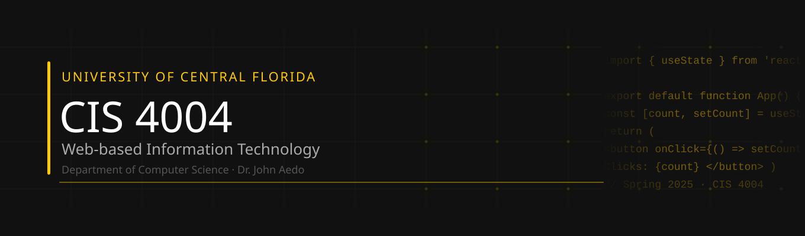

Welcome to the course notes site for CIS 4004. This is the home for material that's too cumbersome for Webcourses or doesn't render well there — reference docs, walkthroughs, live-code demos, and slide decks all live here.

Use the navigation tabs at the top or the sidebar to find what you need. The search bar (top right) works across everything — it's the fastest way to find a specific function, concept, or assignment step.

# During a Project
The Code Demos and Tutorials are intended to be walk-through tutorials.  Use them to come up to speed on the technologies you'll need to complete your projects and feel free to reference individual sections as needed.  The product of these tutorials will be a foundation that you can build on for your projects.

# Before Class
For the time being, most lectures will be on Webcourses, but anything supplemental (i.e., material that I author to augment the base lectures) will be posted here.  Eventually all lectures will be posted here and on Webcourses.

# Something's missing or broken?
Email me with "CIS 4004 Site Bug" in the subject. If a page has a mistake, I'll note corrections at the top of that page.